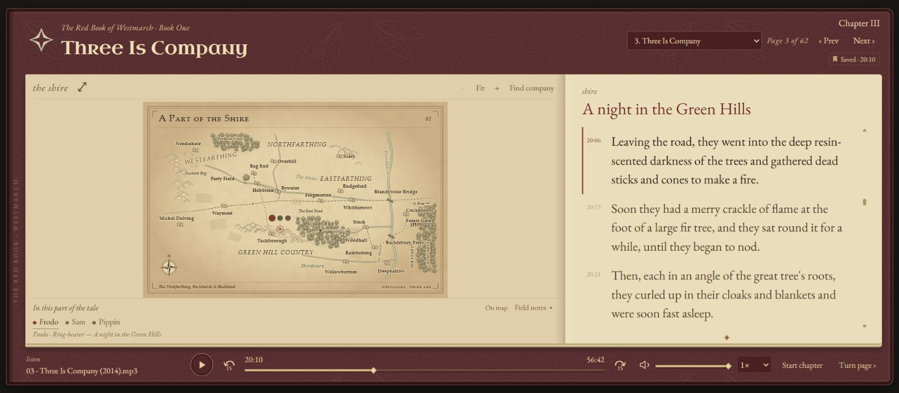
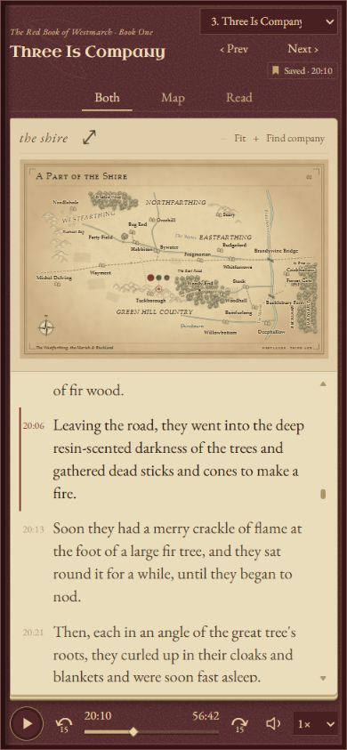
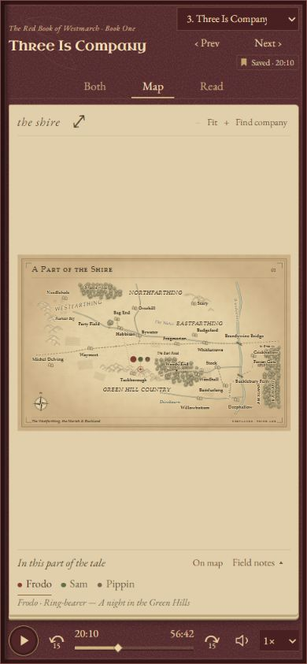
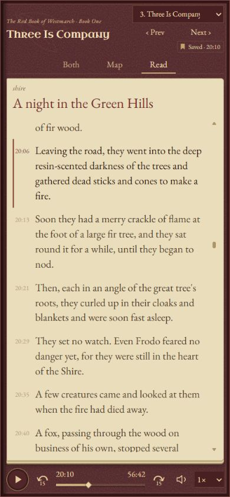

# The Red Book

A local, book-shaped companion for the Phil Dragash *Lord of the Rings* soundscape. Follow the transcript beside an illustrated regional atlas, keep your place between sessions, and watch the story's focus move across Middle-earth.

**No account, build step, subscription, or runtime CDN.** The reader runs in your browser; Python serves your local audio with byte-range support for seeking.



## Inside the book

- **62 chapters across all three volumes**, with a grouped chapter picker.
- **Twelve original regional map plates**, with zoom, drag-to-pan, Fit, Find company, and an enlarged atlas viewer.
- **Complete chapter transcripts**, loaded up front. Click a passage to seek; the current passage is highlighted during playback.
- **Custom audio controls:** play/pause, ±15 seconds, seek, mute/volume, and 0.75–2× playback speed.
- **Local bookmarks:** last chapter, each chapter's playback position, volume and speed. Reopening starts paused. The saved-time badge sits below the chapter controls.
- **Companion tokens and field notes:** narrative-focus rosters, character roles, current setting, transcript evidence, and earlier chapter milestones.
- **Physical page-fold transitions** on desktop, with reduced-motion support.
- **Mobile Both / Map / Read modes**, keeping the controls visible on narrow screens.

### On a smaller screen

Choose **Both** for a split map/transcript, **Map** to explore, or **Read** for a full-height reading page.

<p>
  
  
  
</p>

Screenshots show the app using a personal local media collection. Recordings and full transcripts are **not distributed in this repository**.

## Run locally

### Requirements

- Python **3.10 or newer**.
- A modern browser. Chrome was used for desktop and responsive layout checks.
- Your own lawfully obtained MP3s and timed SRT transcripts for this edition.
- Git to clone the repository; Node.js is optional, for JavaScript checks only.

### 1. Clone

```sh
git clone https://github.com/MuhammadSaad0/LOTR-Phil-Dragash-Soundscape.git
cd LOTR-Phil-Dragash-Soundscape
```

### 2. Arrange your local files

Keep the media outside the repository:

```text
LOTR-Audiobook/
├── Part1/                  # 22 MP3s
├── Part2/                  # 21 MP3s
├── Part3/                  # 19 MP3s
└── Transcripts/
    ├── Part1/
    │   ├── 01 - A Long-Expected Party (2014)/transcription.srt
    │   └── ...
    ├── Part2/
    └── Part3/
```

`chapter-catalog.json` lists the expected audio filenames and chapter ordering. SRT files can live in numbered chapter directories as above, or be directly named `01 - Chapter title.srt` in the relevant Part directory. Chapter numbering restarts within each part. The importer requires exactly one SRT per chapter and imports all 62 chapters.

### 3. Import your transcripts

```sh
python import-transcripts.py "/path/to/LOTR-Audiobook/Transcripts"
```

This creates the private, git-ignored `transcript-data.js`. It preserves timed caption text and does not run speech recognition or upload anything. Re-running replaces that generated file only after all chapters have been parsed successfully.

### 4. Start the reader

```sh
python local-server.py --audio-directory "/path/to/LOTR-Audiobook"
```

Open **http://127.0.0.1:8765/index.html**. On Windows, `run-poc.cmd` uses `%USERPROFILE%\Documents\LOTR-Audiobook` by default; pass a different audio directory as its first argument if needed.

```bat
run-poc.cmd "D:\Audiobooks\LOTR-Audiobook"
```

Stop an older server using the same port before starting this one, or use `--port 8766` and open that port instead. Do not open the HTML with `file://`: use the local server for reliable media loading and seeking.

## Listening and navigation

| Control | Action |
| --- | --- |
| Space, outside form controls | Play / pause |
| Previous / Next; Left / Right; Page Up / Page Down | Change chapter |
| Chapter dropdown | Jump directly; restore that chapter's saved position, paused |
| Click transcript text | Seek and play from that passage |
| Drag seek bar | Seek while preserving play/pause state |
| ±15 buttons | Skip backward / forward |
| Fit / + / − / Find company | Explore the map; drag while zoomed |
| Character name / Field notes | Select a companion and inspect the current setting |
| Both / Map / Read | Change the mobile layout |

Manual transcript scrolling temporarily suspends auto-follow for eight seconds. All lines remain available while audio plays. Bookmarks are stored in browser localStorage: they do not sync across devices, profiles, or origins. **Use the same address each time**—`localhost` and `127.0.0.1` have separate bookmarks. Clearing site data clears saved positions.

## Geography and narrative accuracy

The atlas is original SVG artwork informed by published Middle-earth maps. See [map sources and geographic notes](MAP-NOTES.md).

**105 setting/movement milestones across 46 chapters** are anchored to this collection's transcript timestamps. The other **16 chapters use approximate chapter-percentage timings**. Different edits of the audio may not align with these anchors.

Character tokens show the **narrative-focus group near a scene**, not exact independent positions for every character. Most rosters are chapter-level approximations; only explicitly authored changes are timed. Roles describe characters, not automatically inferred live tasks. Historical milestone dots are not invented road segments. This is a developing listening companion, not a canonical or surveyed geographic simulation.

## Project guide

| Files | Responsibility |
| --- | --- |
| `index.html`, `red-book.css`, `responsive.css` | Reader shell, Red Book appearance, mobile layout |
| `journey-app.js` | Chapters, audio coordination and transcript synchronization |
| `reading-state.js` | Bookmarks and page-fold animation |
| `book-player.js`, `book-player.css` | Custom media controls |
| `atlas-maps.js`, `atlas.css`, `maps/` | Authored geography, SVG rendering and standalone plates |
| `atlas-viewer.js`, `atlas.html`, `map-controls.js` | Enlarged atlas, gallery and map exploration |
| `journey-tracking.js` | Transcript-linked milestones |
| `live-company.js`, `live-company.css` | Companion groups and field notes |
| `mobile-view.js` | Mobile layout switching |
| `chapter-catalog.json`, `import-transcripts.py` | Public chapter metadata and private SRT import |
| `local-server.py`, `run-poc.cmd` | Local byte-range media server and Windows launcher |
| `fonts/`, `binding.svg`, `screenshots/` | Offline fonts, original leather artwork and previews |

The server binds to **127.0.0.1 only**. It is a local development server, not a public hosting service. The configured audio directory is served locally under `/LOTR-Audiobook/`; do not put secrets in that media folder or the project directory.

## Checks

```sh
python -m unittest discover -s tests -p "test_*.py"
node tests/test-live-company.cjs
node --check journey-app.js
node --check reading-state.js
node --check book-player.js
```

The milestone/bookmark check also requires your generated private transcript data:

```sh
node tests/test-red-book.cjs
```

Responsive views were checked at 390×844 and 320×640 with no document overflow. Desktop/mobile screenshots are from the current layout; this is not exhaustive cross-browser testing. Map/timeline data validation covers all authored milestones, and companion tests verify that unchanged playback does not rewrite the companion UI.

## Troubleshooting

- **No transcript:** run the importer and refresh. Check filenames and Part directories if the importer reports missing or duplicate SRTs.
- **Audio unavailable:** check `--audio-directory` and the exact MP3 filename in `chapter-catalog.json`.
- **Seeking fails:** run the included range-capable server rather than a generic static server.
- **Old layout persists:** hard-refresh once after updating the source.
- **Bookmark seems missing:** use the same browser and local address. Private browsing or blocked storage can prevent persistence.
- **Map location feels early or late:** some chapters still use approximate timing; see the accuracy section above.

## Credits and rights

An unofficial fan-made companion. *The Lord of the Rings*, Middle-earth and its characters belong to their respective rights holders. The soundscape recordings are associated with Phil Dragash; this repository neither contains nor grants rights to those recordings or Tolkien's text. Use only media you are entitled to use. No affiliation or endorsement is implied.

EB Garamond and Uncial Antiqua are bundled under the SIL Open Font License; their license files are included in `fonts/`. Map-reference credits are in [MAP-NOTES.md](MAP-NOTES.md). No license for the project's own code is designated yet; bundled font licenses and third-party rights remain separate.
